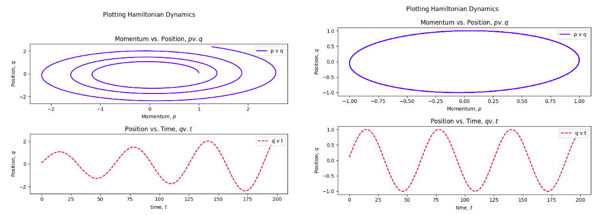

# Spring Hamiltonian

### A set of Python files for simulating the phase space of a weighted spring using Hamiltonian Mechanics.
### To be used with the blog post: [Modelling a Spring System in Hamiltonian Mechanics](https://ritog.github.io/posts/implicit_euler/)

___
#### Files:
* harmonic.py - Hamiltonian derivatives of the variables
* harmonic_simulator.py - generating plots using Euler's Method
* harmonic_simulator_implicit.py - generating plots using Semi-Implicit Euler's Method 

#### Dependencies
- Matplotlib
- uv is used for this project

